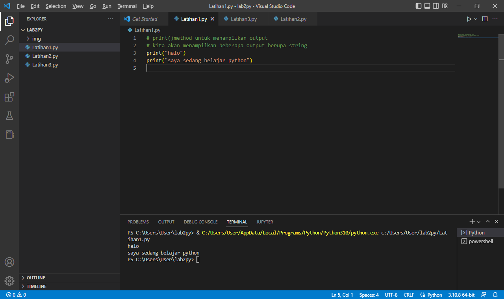
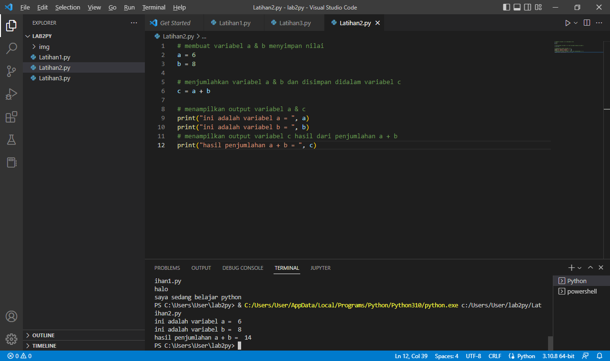
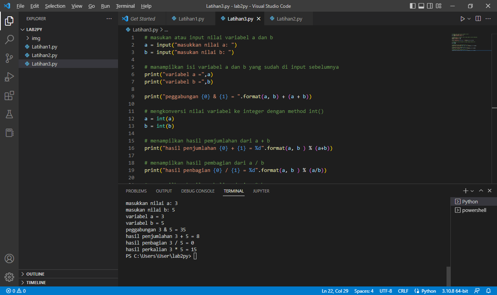

# belajar pyton 

  - [latihan 1](#latihan-1)
  - [latihan 2](#latihan-2)

## latihan 1
Membuat latihan 1 
ikuti kode dibawah ini :

```python
# print()method untuk menampilkan output
# kita akan menampilkan beberapa output berupa string
print("halo")
print("saya sedang belajar python")

```
  
  Berikut Hasil dari code diatas
  

## latihan 2
Membuat latihan 2 
ikuti kode dibawah ini :

```python
# membuat variabel a & b menyimpan nilai
a = 6
b = 8

# menjumlahkan variabel a & b dan disimpan didalam variabel c
c = a + b

# menampilkan output variabel a & c 
print("ini adalah variabel a = ", a)
print("ini adalah variabel b = ", b)
# menampilkan output variabel c hasil dari penjumlahan a + b
print("hasil penjumlahan a + b = ", c)

```

Berikut Hasil dari code diatas
  

## latihan 3
Membuat latihan 3 
ikuti kode dibawah ini :

```python
# masukan atau input nilai variabel a dan b
a = input("masukkan nilai a: ")
b = input("masukan nilai b: ")

# manampilkan isi variabel a dan b yang sudah di input sebelumnya
print("variabel a =",a)
print("variabel b =",b)

print("peggabungan {0} & {1} = ".format(a, b) + (a + b))

# mengkonversi nilai variabel ke integer dengan method int()
a = int(a)
b = int(b)

# menampilkan hasil pemjumlahan dari a + b
print("hasil penjumlahan {0} + {1} = %d".format(a, b ) % (a+b))

# menampilkan hasil pembagian dari a / b
print("hasil penbagian {0} / {1} = %d".format(a, b ) % (a/b))

# menampilkan hasil perkalian dari a * b
print("hasil perkalian {0} * {1} = %d".format(a, b ) % (a*b))

```

Berikut Hasil dari code diatas
  